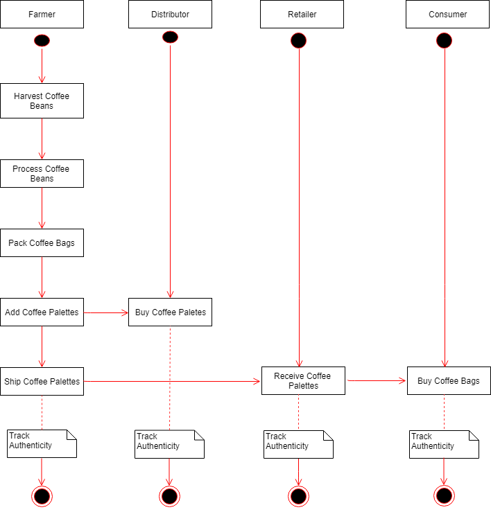
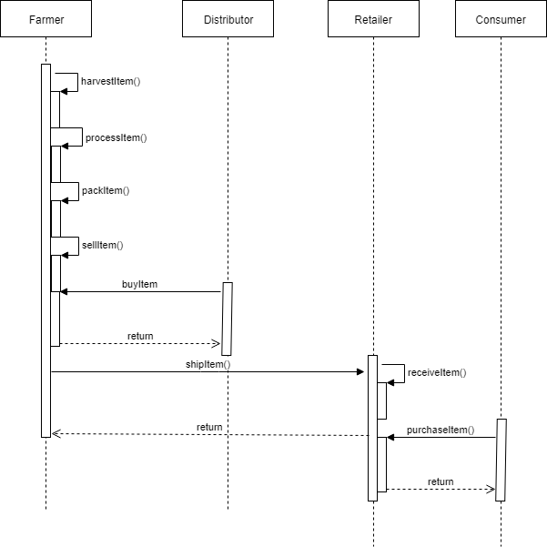
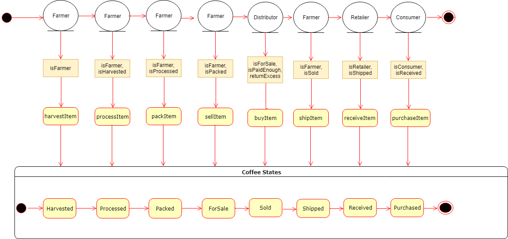
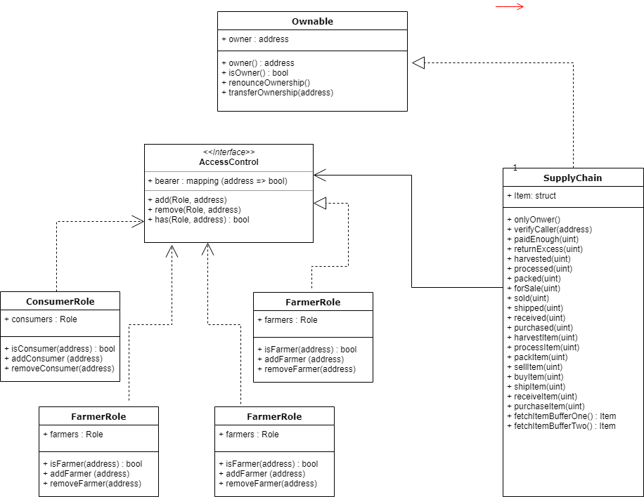
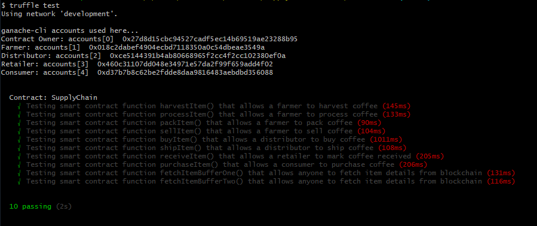
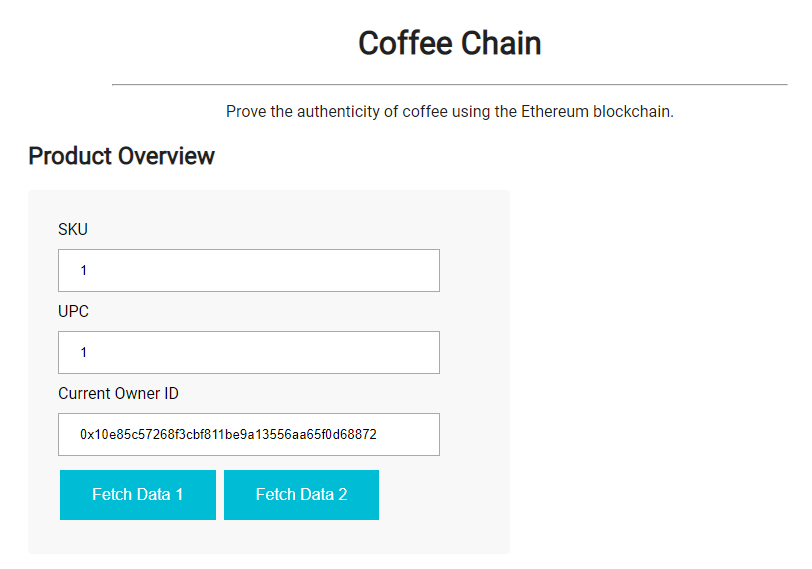
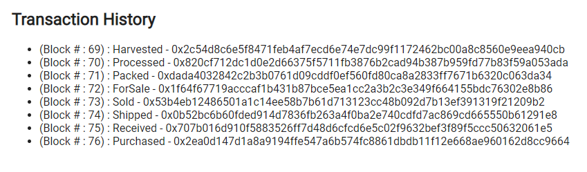

# CoffeeChain (Authentic Coffee )

This is an Ethereum DApp that demonstrates a Supply Chain flow between a Seller and Buyer. The user story is similar to any commonly used supply chain process. A Seller can add items to the inventory system stored in the blockchain. A Buyer can purchase such items from the inventory system.


## Libraries Used

* [Ethereum](https://www.ethereum.org/) - Ethereum is a decentralized platform that runs smart contracts
* [Truffle Framework](http://truffleframework.com/) - Truffle is the most popular development framework for Ethereum with a mission to make your life a whole lot easier.
* [Truffle Framework](http://truffleframework.com/) - Truffle is the most popular development framework for Ethereum with a mission to make your life a whole lot easier.

## Atchitecture

### Activity Diagram

### Sequence Diagram

### State Diagram

### Class Diagram



## Getting Started

These instructions will get you a copy of the project up and running on your local machine for development and testing purposes. See deployment for notes on how to deploy the project on a live system.

### Prerequisites

Please make sure you've installed following packages.
1. Install ganache-cli
`npm install -g ganache-cli`
2. Install Truffle v4
`npm install -g truffle@4`
3. Enable MetaMask extension in browser

### Installing

A step by step series of examples that tell you have to get a development env running

Clone this repository:

```
git clone https://github.com/faisal-hameed/AuthenticSupplyChain.git
```

Change directory to ```coffeechain``` folder and install all requisite npm packages (as listed in ```package.json```):

```
cd coffeechain
npm install
```

Launch Ganache:

```
ganache-cli -m "spirit supply whale amount human item harsh scare congress discover talent hamster"
```

Your terminal should look something like this:


In a separate terminal window, Compile smart contracts:

```
truffle compile
```

Your terminal should look something like this:


This will create the smart contract artifacts in folder ```build\contracts```.

Migrate smart contracts to the locally running blockchain, ganache-cli:

```
truffle migrate
```

Your terminal should look something like this:


Test smart contracts:

```
truffle test
```

All 10 tests should pass.



In a separate terminal window, launch the DApp:

```
npm run dev
```


# VisualStudio Code setting
1. Install solium linter
`npm install -g ethlint` 
and configure settings.json in VSCode editor
```
{
    "files.autoSave": "off",
    "solidity.compileUsingRemoteVersion" : "v0.4.24+commit.e67f0147",
    "solidity.enabledAsYouTypeCompilationErrorCheck": true,
    "solidity.validationDelay": 1500,
    "solidity.linter": "solium",
    "solidity.soliumRules": {
        "quotes": ["error", "double"],
        "indentation": ["error", 2]
    }
}
```

## Deployment on Live network

In order to deploy on live test network, execute following command.
`$ truffle migrate --clean --network rinkeby`
Result should be:
```
Using network 'rinkeby'.

Running migration: 1_initial_migration.js
  Deploying Migrations...
  ... 0x98aa204ab089991de6bde404df97c106d14b899cb0e69ead17d599b41fcbc880
  Migrations: 0x21590c254cc9877512a66b7147e4f1eb1cda94ad
Saving successful migration to network...
  ... 0xdc6f7222a01b3b67ab421c3bf7d853257d3abde14aa99d548e6dec72226462ed
Saving artifacts...
Running migration: 2_deploy_contracts.js
  Deploying FarmerRole...
  ... 0xb337a9b6f09dbfd67cb917e9876be89f511d87c5507dc35563ad16404fd762d2
  FarmerRole: 0x7cf2c4d107aef230362831db130cff6cd8e044a1
  Deploying DistributorRole...
  ... 0xc6b247460c85b2ddaad12db7505b3c390140145fc359f17ad73b53fd16f37ce0
  DistributorRole: 0x9065748723d0f9d515c7f6c60737d97beb1ce3e0
  Deploying RetailerRole...
  ... 0x656cbfcd8446caace4a82def7afcce01e6578d646849541772a2aba181594fda
  RetailerRole: 0x3253fab4a99e8c29f538dbfab9dc8b69a2a2457d
  Deploying ConsumerRole...
  ... 0xa49077260ffdd4270eff288af54d63cff841e5da64d3dfdd2c1547c6b4687e30
  ConsumerRole: 0xd5129f9432df79de1ecbb346c51b041b8ad07656
  Deploying SupplyChain...
  ... 0xfd661882662902734d637920d95abd9e1c1ef8dd60a3bd0bb7112f40b9355181
  SupplyChain: 0x19aa63c20c611b82184a721563b880cd5f19d1ab
Saving successful migration to network...
  ... 0xc2ca448cde31a946c8cc74c1131725d92612f8d48e11c98503895139fa5a9a24
Saving artifacts...
```
#### SupplyChain contract address : 0x19aa63c20c611b82184a721563b880cd5f19d1ab


# UI
The DApp User Interface when running should look like...




